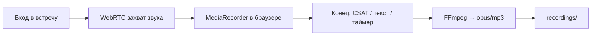

# Telemost Recorder

Production-ready CLI-инструмент в Docker-контейнере для записи встреч **Яндекс.Телемост** в строго **анонимном режиме**.

Контейнер стартует → открывает ссылку → вводит имя → подключается к встрече → **захватывает звук через WebRTC** → при завершении встречи (в т.ч. опрос CSAT) сохраняет аудио через FFmpeg → завершается.

**Не поддерживается:** авторизация, API, Redis, веб-сервер, очереди.

---

## Быстрый старт

```bash
# 1. Клонировать репозиторий на Ubuntu-сервер
git clone https://github.com/UnSait/telemost-recorder.git
cd telemost-recorder

# 2. Развернуть (установит Docker, соберёт образ)
chmod +x deploy.sh
./deploy.sh

# 3. Записать встречу (по умолчанию — Opus)
docker run --rm --ipc=host -v $(pwd)/recordings:/app/recordings \
  telemost-recorder "https://telemost.yandex.ru/j/XXXXXXXX"
```

После обновления кода:

```bash
git pull
docker build -t telemost-recorder .
```

---

## Куда сохраняются файлы

При стандартном запуске с `-v $(pwd)/recordings:/app/recordings`:

| Где | Путь |
|-----|------|
| На сервере (хост) | `./recordings/` в папке проекта |
| В контейнере | `/app/recordings/` |

**Имя файла:** `ГГГГММДД_ЧЧММСС_ID_ВСТРЕЧИ.{opus|mp3}`

Примеры:

```
recordings/20260701_231715_53830818664699.opus   # --format opus (по умолчанию)
recordings/20260701_231715_53830818664699.mp3    # --format mp3
```

Другая папка на хосте:

```bash
docker run --rm --ipc=host -v /path/on/host:/app/recordings \
  telemost-recorder "URL" --format mp3
```

Или флаг `--output-dir` (путь внутри контейнера, должен совпадать с точкой монтирования volume).

---

## Примеры запуска

```bash
# Базовый запуск (аудио в формате Opus)
docker run --rm --ipc=host -v $(pwd)/recordings:/app/recordings \
  telemost-recorder "https://telemost.yandex.ru/j/1234567890"

# MP3 вместо Opus
docker run --rm --ipc=host -v $(pwd)/recordings:/app/recordings \
  telemost-recorder "https://telemost.yandex.ru/j/1234567890" --format mp3

# Ограничение длительности — 1 час
docker run --rm --ipc=host -v $(pwd)/recordings:/app/recordings \
  telemost-recorder "https://telemost.yandex.ru/j/1234567890" --max-duration 3600

# Режим отладки (скриншоты + лог DOM; на сервере работает в headless)
docker run --rm --ipc=host -v $(pwd)/recordings:/app/recordings \
  telemost-recorder "https://telemost.yandex.ru/j/1234567890" --debug \
  2>&1 | tee recordings/last_run.log

# Кастомное имя в списке участников
docker run --rm --ipc=host -v $(pwd)/recordings:/app/recordings \
  telemost-recorder "https://telemost.yandex.ru/j/1234567890" \
  --bot-name "Запись встречи"

# Уменьшенное разрешение видео (меньше RAM; на звук не влияет)
docker run --rm --ipc=host -v $(pwd)/recordings:/app/recordings \
  telemost-recorder "https://telemost.yandex.ru/j/1234567890" --video-resolution 480x270
```

---

## Аргументы CLI

| Аргумент | Обязательный | По умолчанию | Описание |
|----------|:---:|---|---|
| `meeting_url` | ✅ | — | HTTPS-ссылка на встречу `telemost.yandex.ru` |
| `--output-dir` | | `/app/recordings` | Директория для сохранения аудиофайлов |
| `--bot-name` | | `🤖 AI Ассистент` | Имя, отображаемое в списке участников |
| `--max-duration` | | `14400` (4 ч) | Максимальная длительность записи в секундах |
| `--format` | | `opus` | Формат аудио: `opus` или `mp3` |
| `--video-resolution` | | `640x360` | Разрешение служебной видеозаписи Playwright (RAM) |
| `--debug` | | выкл. | Подробные логи + скриншоты (на сервере — headless) |

### Коды выхода

| Код | Значение |
|:---:|---|
| `0` | Успешная запись |
| `1` | Общая ошибка (URL, DOM, FFmpeg, браузер) |
| `2` | Встреча требует авторизации |
| `3` | Встреча уже завершена или недоступна (файл не сохранён) |
| `130` | Прервано SIGINT (Ctrl+C), частичная запись сохранена |
| `143` | Прервано SIGTERM, частичная запись сохранена |

---

## Как это работает



1. **Звук** — перехват WebRTC audio tracks во фреймах Телемоста (`webrtc_audio.py`) → основной результат
2. **Видео Playwright** — пишется служебно во временную папку (`record_video_dir`), **без звука**; используется только как fallback, если WebRTC не сработал. В `recordings/` попадает **только аудио** (opus/mp3)
3. **Конец встречи** — текст «Встреча завершена», исчезновение таймера, **опрос CSAT** (звёзды)
4. **Сохранение** — аудио сбрасывается до навигации на CSAT, затем FFmpeg

---

## Структура проекта

```
telemost-recorder/
├── main.py              # CLI entry point (argparse)
├── recorder.py          # TelemostRecorder — Playwright lifecycle
├── dom_scanner.py       # Семантический поиск элементов предкомнаты
├── webrtc_audio.py      # Захват звука встречи через WebRTC/MediaRecorder
├── audio_extractor.py   # Конвертация WebM → opus/mp3 через FFmpeg
├── Dockerfile
├── requirements.txt
├── deploy.sh            # Развёртывание на Ubuntu
└── README.md
```

---

## Логи и файлы

**Успешный прогон** (фрагмент stdout):

```
📦 telemost-recorder 2026-07-02-webrtc-audio-v7
🔗 Открытие встречи...
👤 Ввод имени...
🖱 Нажимаем: 'Подключиться'
✅ Подключение к встрече...
🎙 Аудиозахват: tracks=3, recorder=recording, hooks=True
⏺ Запись начата
⏹ Встреча завершена
🎵 Извлечение аудио...
💾 Сохранено: /app/recordings/20260701_231715_53830818664699.opus
```

**Проверка на сервере:**

```bash
ls -lh recordings/*.opus recordings/*.mp3
ffprobe recordings/ВАШ_ФАЙЛ.opus 2>&1 | grep Audio
```

**Скачать на ПК:**

```bash
scp user@server:~/telemost-recorder/recordings/*.opus .
```

**Очистка:**

```bash
rm -f recordings/*.opus recordings/*.mp3 recordings/*.webm
rm -rf recordings/debug_* recordings/last_run.log
```

**Debug-артефакты** (при `--debug`): `recordings/debug_YYYYMMDD_HHMMSS/step_NN_*.png`

---

## Troubleshooting

### Бот не находит кнопку / поле имени

Запустите с `--debug` и проверьте скриншоты в `recordings/debug_*`. В stdout — список DOM-кандидатов. При смене UI Телемоста правьте regex в `dom_scanner.py`.

### Встреча требует вход в аккаунт

```
❌ Встреча требует авторизации. Анонимный вход недоступен.
```

Организатор отключил гостевой вход. Бот авторизацию не поддерживает.

### Встреча уже завершена (exit code 3)

```
⏹ Встреча завершена — показан опрос CSAT
```

Запускайте бота **пока встреча идёт**, с **новой** ссылкой.

### Нет звука в файле (`tracks=0`)

В debug после входа смотрите:

```
🎙 Аудиозахват: tracks=0, recorder=none
```

- Встреча без речи в микрофон
- Бот подключился слишком поздно
- Нужно говорить в микрофон, чтобы WebRTC отдал дорожки

При успехе: `tracks≥1`, `recorder=recording`, в конце `💾 Сохранено`.

### OOM (нехватка памяти)

```bash
docker run --rm --ipc=host --memory=1g -v $(pwd)/recordings:/app/recordings \
  telemost-recorder "URL" --video-resolution 480x270
```

### Graceful shutdown

`Ctrl+C` или `docker stop` — сохраняется частичная запись (exit `130` / `143`).

---

## Юридическое предупреждение

**Скрытая запись разговоров без уведомления участников является нарушением законодательства РФ:**

- **Ст. 138 УК РФ** — незаконное ограничение тайны переписки, телефонных переговоров и иных сообщений
- **152-ФЗ** — обработка персональных данных без согласия субъектов

**Участники встречи ДОЛЖНЫ быть уведомлены о записи.** Бот виден в списке участников как `🤖 AI Ассистент` (или `--bot-name`) — это не заменяет юридически значимое уведомление.

---

## Технический стек

- Python 3.11+
- Playwright 1.60.0 (async API, `headless=new`)
- WebRTC MediaRecorder (in-page audio capture)
- FFmpeg (WebM → opus/mp3)
- Docker (`mcr.microsoft.com/playwright/python:v1.60.0-noble`)
- Целевая ОС: Ubuntu Server 22.04/24.04 (без GUI)
