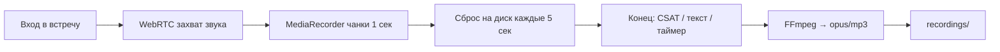

# Telemost Recorder

Production-ready CLI-инструмент в Docker-контейнере для записи встреч **Яндекс.Телемост** в строго **анонимном режиме**.

Контейнер стартует → открывает ссылку → вводит имя → подключается к встрече → **захватывает звук через WebRTC** → при завершении встречи (в т.ч. опрос CSAT) сохраняет аудио через FFmpeg → завершается.

**Не поддерживается:** авторизация, API, Redis, веб-сервер, очереди.

---

## Быстрый старт

```bash
# 1. Клонировать репозиторий на Ubuntu-сервер
git clone https://github.com/UnSait/telemost-recorder.git
cd telemost-recorder

# 2. Развернуть (установит Docker, соберёт образ)
chmod +x deploy.sh
./deploy.sh

# 3. Записать встречу (по умолчанию — Opus)
docker run --rm --ipc=host -v $(pwd)/recordings:/app/recordings \
  telemost-recorder "https://telemost.yandex.ru/j/XXXXXXXX"
```

После обновления кода:

```bash
git pull
docker build -t telemost-recorder .
```

---

## Куда сохраняются файлы

При стандартном запуске с `-v $(pwd)/recordings:/app/recordings`:

| Где | Путь |
|-----|------|
| На сервере (хост) | `./recordings/` в папке проекта |
| В контейнере | `/app/recordings/` |

**Имя файла:** `ГГГГММДД_ЧЧММСС_ID_ВСТРЕЧИ.{opus|mp3}`

Примеры:

```
recordings/20260701_231715_53830818664699.opus   # --format opus (по умолчанию)
recordings/20260701_231715_53830818664699.mp3    # --format mp3
```

Другая папка на хосте:

```bash
docker run --rm --ipc=host -v /path/on/host:/app/recordings \
  telemost-recorder "URL" --format mp3
```

Или `--output-dir` (путь **внутри контейнера**; при смене флага измените и `-v` слева, чтобы папки совпадали).

---

## Примеры запуска

Необязательные флаги (`--format`, `--bot-name`, `--max-duration`, `--debug`) **можно комбинировать в одной команде** — порядок после URL не важен.

```bash
# Минимальный запуск: Opus, имя «🤖 AI Ассистент», лимит 4 часа
docker run --rm --ipc=host -v $(pwd)/recordings:/app/recordings \
  telemost-recorder "https://telemost.yandex.ru/j/1234567890"

# Типичный запуск: MP3 + своё имя + лимит 1 час
docker run --rm --ipc=host -v $(pwd)/recordings:/app/recordings \
  telemost-recorder "https://telemost.yandex.ru/j/1234567890" \
  --format mp3 \
  --bot-name "Запись встречи" \
  --max-duration 3600

# Отладка (скриншоты + лог DOM; на сервере — headless)
docker run --rm --ipc=host -v $(pwd)/recordings:/app/recordings \
  telemost-recorder "https://telemost.yandex.ru/j/1234567890" --debug \
  2>&1 | tee recordings/last_run.log
```

| Флаг | Что делает |
|------|------------|
| `--format mp3` | Сохранить MP3 вместо Opus (по умолчанию — `opus`) |
| `--bot-name "…"` | Имя бота в списке участников (видно всем) |
| `--max-duration 3600` | Остановить запись через N секунд (минимум 60; по умолчанию 14400 = 4 ч) |
| `--debug` | Подробные логи, скриншоты, строка `Аудиозахват: tracks=…` |

---

## Аргументы CLI

| Аргумент | Обязательный | По умолчанию | Описание |
|----------|:---:|---|---|
| `meeting_url` | ✅ | — | HTTPS-ссылка на встречу `telemost.yandex.ru` |
| `--output-dir` | | `/app/recordings` | Директория для сохранения аудиофайлов |
| `--bot-name` | | `🤖 AI Ассистент` | Имя, отображаемое в списке участников |
| `--max-duration` | | `14400` (4 ч) | Максимальная длительность записи в секундах (минимум 60) |
| `--format` | | `opus` | Формат аудио: `opus` или `mp3` |
| `--debug` | | выкл. | Подробные логи + скриншоты (на сервере — headless) |

### Коды выхода

| Код | Значение |
|:---:|---|
| `0` | Успешная запись |
| `1` | Общая ошибка (URL, DOM, FFmpeg, WebRTC `tracks=0`, браузер) |
| `2` | Встреча требует авторизации |
| `3` | Встреча недоступна или завершилась до сохранения аудио (файл не создан) |
| `130` | Прервано SIGINT (Ctrl+C); при наличии аудио — частичная запись сохранена |
| `143` | Прервано SIGTERM; при наличии аудио — частичная запись сохранена |

---

## Как это работает



1. **Звук** — перехват WebRTC audio tracks (речь участников) → MediaRecorder → чанки **сбрасываются на диск каждые 5 сек** (RAM не растёт всю встречу)
2. **Конец встречи** — текст «Встреча завершена», исчезновение таймера, **опрос CSAT** (звёзды)
3. **Сохранение** — финальные чанки + FFmpeg → `recordings/*.opus` или `*.mp3`

---

## Структура проекта

```
telemost-recorder/
├── main.py              # CLI entry point (argparse)
├── recorder.py          # TelemostRecorder — Playwright lifecycle
├── dom_scanner.py       # Семантический поиск элементов предкомнаты
├── webrtc_audio.py      # WebRTC/MediaRecorder + сброс чанков на диск
├── audio_extractor.py   # Конвертация WebM → opus/mp3 через FFmpeg
├── Dockerfile
├── requirements.txt
├── deploy.sh            # Развёртывание на Ubuntu
└── README.md
```

---

## Логи и файлы

**Успешный прогон** (фрагмент stdout, без `--debug`):

```
📦 telemost-recorder 2026-07-02-webrtc-audio-v9.1
🔗 Открытие встречи...
👤 Ввод имени...
🖱 Нажимаем: 'Подключиться'
✅ Подключение к встрече...
⏺ Запись начата
⏹ Встреча завершена
🎵 Извлечение аудио...
💾 Сохранено: /app/recordings/20260701_231715_53830818664699.opus
```

С `--debug` дополнительно появится строка `🎙 Аудиозахват: tracks=3, recorder=recording, hooks=True`.

**Проверка на сервере:**

```bash
ls -lh recordings/*.opus recordings/*.mp3
ffprobe recordings/ВАШ_ФАЙЛ.opus 2>&1 | grep Audio
```

**Скачать на ПК:**

```bash
scp user@server:~/telemost-recorder/recordings/*.opus .
```

**Очистка:**

```bash
rm -f recordings/*.opus recordings/*.mp3
rm -rf recordings/debug_* recordings/last_run.log
```

**Debug-артефакты** (при `--debug`): `recordings/debug_YYYYMMDD_HHMMSS/step_NN_*.png`

---

## Troubleshooting

### Бот не находит кнопку / поле имени

Запустите с `--debug` и проверьте скриншоты в `recordings/debug_*`. В stdout — список DOM-кандидатов. При смене UI Телемоста правьте regex в `dom_scanner.py`.

### Встреча требует вход в аккаунт

```
❌ Встреча требует авторизации. Анонимный вход недоступен.
```

Организатор отключил гостевой вход. Бот авторизацию не поддерживает.

### Встреча недоступна (exit code 3)

Бот не успел войти или встреча закрылась **до сохранения файла** (например, ссылка уже неактивна, CSAT/лобби при открытии страницы):

```
⏹ Встреча завершена — …
ℹ️ Запись не сохранена — встреча завершилась слишком быстро или WebRTC не захватил звук.
```

Запускайте бота **пока встреча идёт**, с **актуальной** ссылкой.

**Нормальное завершение:** встреча идёт → бот пишет звук → появляется CSAT → файл сохраняется → **exit code 0**.

### WebRTC не захватил звук (`tracks=0`, exit code 1)

После входа в встречу запустите с `--debug` и проверьте строку:

```
🎙 Аудиозахват: tracks=0, recorder=none
```

Возможные причины:

- Бот подключился до появления участников со звуком
- Встреча была тихой (никто не говорил)
- Сменился UI Телемоста / хуки не сработали

При успехе: `tracks≥1`, `recorder=recording`, в конце `💾 Сохранено`.

### Потребление ресурсов

Замеры через `docker stats` во время тестовой записи (**v9.1**, **~21 мин**, `tracks=3`, живой разговор).

**Сервер тестирования:**

| | |
|--|--|
| ОС | Ubuntu 26.04 |
| CPU | 1 core |
| RAM | 4 GB |
| Диск | 10 GB NVMe |

**Один бот (контейнер):**

| Метрика | Значение |
|---------|----------|
| **RAM** | пик **345 MiB**, в записи **270–330 MiB** |
| **CPU** | обычно **10–15%**, пики до **~43%** |
| **Файл opus** | **18.3 MB** (~**0.87 MB/мин**) |

RAM в записи **не растёт** — чанки сбрасываются на диск каждые 5 сек (v9). На VPS **≥1 GB RAM** на контейнер достаточно с запасом.

Проверить RAM во время записи:

```bash
docker stats --no-stream $(docker ps -q --filter ancestor=telemost-recorder)
```

### OOM (нехватка памяти)

С v9 чанки сбрасываются на диск каждые 5 сек. По замерам контейнер держит **~300 MiB** RAM; лимит **1 GB** достаточен с запасом.

На слабом VPS задайте лимит памяти Docker:

```bash
docker run --rm --ipc=host --memory=1g -v $(pwd)/recordings:/app/recordings \
  telemost-recorder "URL" --max-duration 3600
```

### Graceful shutdown

`Ctrl+C` или `docker stop` — бот пытается сохранить частичную запись (exit `130` / `143`), если WebRTC уже захватил звук.

---

## Юридическое предупреждение

**Скрытая запись разговоров без уведомления участников является нарушением законодательства РФ:**

- **Ст. 138 УК РФ** — незаконное ограничение тайны переписки, телефонных переговоров и иных сообщений
- **152-ФЗ** — обработка персональных данных без согласия субъектов

**Участники встречи ДОЛЖНЫ быть уведомлены о записи.** Бот виден в списке участников как `🤖 AI Ассистент` (или `--bot-name`) — это не заменяет юридически значимое уведомление.

---

## Технический стек

- Python 3.11+
- Playwright 1.60.0 (async API, headless Chromium — только навигация и DOM)
- WebRTC MediaRecorder + инкрементальный сброс чанков на диск
- FFmpeg (WebM → opus/mp3)
- Docker (`mcr.microsoft.com/playwright/python:v1.60.0-noble`)
- Целевая ОС: Ubuntu Server 22.04/24.04/26.04 (без GUI)
